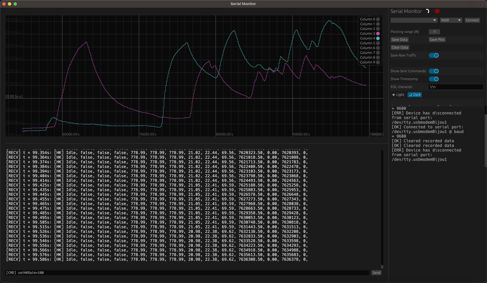

# Serial Monitor

<a href="https://github.com/hacknus/serial-monitor-rust/releases"> </img> </a>

A cross-platform serial monitor and plotter written entirely in rust, the GUI is written
using [egui](https://github.com/emilk/egui).  
Inspired by the serial monitor/plotter from the Arduino IDE, but both plotting and reading the traffic can be done
simultaneously.

[Binary bundles](https://github.com/hacknus/serial-monitor-rust/releases) are available for Linux, macOS and Windows.

Running the apple silicon binary may result to the message "Serial Monitor is damaged and cannot be opened.", to get
around this you first need to run:  
`xattr -rd com.apple.quarantine Serial\ Monitor.app`

Features:

- [X] Plotting and printing of data simultaneously
- [X] Smart data parser, works with ", " or "," or ":" or ": "
- [X] History of the past sent commands
- [X] Low CPU Usage, lightweight
- [X] Clear history options
- [X] Data Window width (number of displayed datapoints in plot) is adjustable
- [X] Cross-platform, fully written in Rust
- [X] Ability to save text to file
- [X] Ability to save the plot
- [X] Allow to put in labels for the different data columns (instead of column 1, 2, ...)
- [X] Allow to choose Data-bits, Flow-Control, Parity and Stop-Bits for Serial Connection
- [X] Saves the configuration for the serial port after closing and reloads them automatically upon selection
- [X] Option to save raw data to file
- [X] Use keyboard shortcuts (ctrl-S to save data, ctrl-shift-S to save plot, ctrl-X to clear plot)
- [ ] Allow to select (and copy) more than just the displayed raw traffic (also implement ctrl + A)
- [ ] Smarter data parser
- [ ] make serial print selectable and show corresponding datapoint in plot
- [ ] COM-Port names on Windows (display manufacturer, name, pid or vid of device?)
- [ ] make side panel and plot/serial prompt be resizeable (snappy?)
- [ ] current command entered is lost when navigating through the history
- [ ] command history is currently unlimited (needs an upper limit to prevent huge memory usage)
- [ ] data history is currently unlimited (needs an upper limit to prevent huge memory usage)
- [ ] ...



The source code can be run using ```cargo run``` or bundled to a platform-executable using cargo bundle.  
Currently [cargo bundle](https://github.com/burtonageo/cargo-bundle) only supports linux and macOS
bundles [see github issue](https://github.com/burtonageo/cargo-bundle/issues/77).
As a work-around we can use [cargo wix](https://github.com/volks73/cargo-wix) to create a windows installer.

After downloading  
```cargo install cargo-bundle``` or ```cargo install cargo-wix```  
run  
```cargo bundle``` or ```cargo wix``` to create platform-executable bundles.

It can be compiled and run on all platforms.

Tested on:

- macOS 12.4 Monterey x86
- macOS 13.2.1 Ventura ARM
- Debian 12 (Testing) x86
- Windows 10 x86
- ...

On Linux first install the following:

```sh
sudo apt-get install libxcb-render0-dev libxcb-shape0-dev libxcb-xfixes0-dev libxkbcommon-dev libssl-dev
```

One might have to delete the ```Cargo.lock``` file before compiling.  
